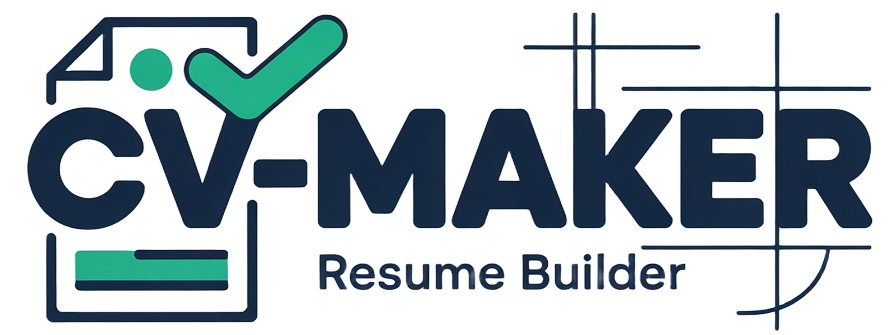

# CV Maker

A modern, professional CV/Resume builder built with Laravel 12 and React 19. Create, manage, and share beautiful CVs with multiple templates and export to PDF.



## Features

### Core Functionality
- 🎨 **4 Distinct CV Templates**
  - **Europass**: Professional two-column timeline layout with comprehensive sections
  - **Modern**: Contemporary sidebar design with visual flair and gradient accents
  - **Classic**: Traditional centered layout with serif fonts and formal styling
  - **Minimalist**: Ultra-clean design focused on content with minimal decorations

- 📝 **Comprehensive CV Builder**
  - Personal information and contact details
  - Work experience with timeline
  - Education and qualifications
  - Skills and competencies (categorized)
  - Languages with proficiency levels (CEFR)
  - Certifications and licenses
  - Projects and portfolio
  - Publications
  - Volunteer experience
  - Profile photo upload with image editor

- 🎨 **Customization**
  - Customizable accent colors per CV
  - Template-specific default colors
  - Real-time PDF preview
  - Responsive admin interface

- 🔗 **Public Sharing**
  - Generate unique shareable links
  - Public/private toggle per CV
  - View tracking and analytics
  - No search engine indexing (noindex)
  - Shareable PDF downloads

- 📄 **PDF Export**
  - High-quality PDF generation
  - A4 format with proper print styles
  - Template-specific styling preserved
  - Download or view in browser

### Admin Features (Filament v4)
- Modern admin panel at `/admin`
- CV management with advanced filtering
- Bulk operations (delete, restore)
- Soft deletes with trash management
- Publish/unpublish CVs with one click
- Real-time preview on edit page
- Responsive table with customizable columns

## Tech Stack

### Backend
- **Laravel 12** - Latest Laravel framework
- **PHP 8.3** - Modern PHP features
- **SQLite** - Lightweight database
- **Spatie Laravel PDF** - PDF generation with Browsershot
- **Filament v4** - Modern admin panel framework
- **Livewire v3** - Server-driven interactivity

### Frontend
- **Inertia.js v2** - Modern monolith SPA experience
- **React 19** - Latest React with automatic JSX runtime
- **Tailwind CSS v4** - Utility-first CSS framework
- **Framer Motion** - Animation library
- **TypeScript** - Type-safe JavaScript
- **Vite** - Fast build tool with HMR

### Development Tools
- **Laravel Pint** - Opinionated PHP code formatter
- **Pest v4** - Elegant PHP testing framework with browser testing
- **Prettier** - Code formatter for JS/TS/CSS
- **ESLint v9** - JavaScript/TypeScript linter

## Requirements

- PHP 8.3+
- Composer 2.x
- Node.js 20+ and npm
- SQLite extension enabled
- Laravel Herd (recommended) or any web server

## Installation

### Quick Setup

```bash
# Clone the repository
git clone <repository-url>
cd cv-maker

# Run the automated setup script
composer run setup
```

The setup script will:
1. Install PHP dependencies (`composer install`)
2. Create `.env` file from `.env.example`
3. Generate application key
4. Run database migrations
5. Install JavaScript dependencies (`npm install`)
6. Build frontend assets (`npm run build`)

### Manual Setup

```bash
# Install dependencies
composer install
npm install

# Configure environment
cp .env.example .env
php artisan key:generate

# Setup database
php artisan migrate

# Build frontend assets
npm run build
```

### First User

Create an admin user to access the panel:

```bash
php artisan make:filament-user
```

## Development

### Starting Development Server

**All-in-one (recommended):**
```bash
composer run dev
```

This starts Laravel server, Vite dev server, queue worker, and log viewer concurrently.

**With SSR:**
```bash
composer run dev:ssr
```

**Individual services:**
```bash
php artisan serve          # Laravel development server
npm run dev               # Vite dev server with HMR
php artisan queue:listen  # Queue worker
php artisan pail          # Real-time log viewer
```

### Building for Production

```bash
npm run build              # Build frontend assets
npm run build:ssr         # Build with SSR support
```

### Code Quality

**PHP (must run before committing):**
```bash
vendor/bin/pint --dirty    # Format modified PHP files
```

**JavaScript/TypeScript:**
```bash
npm run format            # Format all JS/TS/CSS files
npm run format:check      # Check formatting without changes
npm run lint              # Lint JavaScript/TypeScript
npm run types             # Type check TypeScript
```

### Testing

```bash
# Run all tests
php artisan test

# Run specific test file
php artisan test tests/Feature/ExampleTest.php

# Run tests matching a pattern
php artisan test --filter=testName

# Run browser tests (Pest v4)
php artisan test tests/Browser/
```

## Project Structure

```
cv-maker/
├── app/
│   ├── Enums/                    # CVTemplate enum with template definitions
│   ├── Filament/
│   │   ├── Resources/CVS/        # CV Resource for admin panel
│   │   │   ├── Pages/            # Custom pages (EditCV with preview)
│   │   │   ├── Schemas/          # Form schema (CVForm)
│   │   │   └── Tables/           # Table configuration (CVSTable)
│   │   └── Pages/                # Additional Filament pages
│   ├── Http/
│   │   └── Controllers/
│   │       ├── CVController.php          # CV preview and PDF download
│   │       └── PublicCVController.php    # Public CV sharing
│   ├── Models/
│   │   ├── CV.php                # Main CV model with relationships
│   │   ├── WorkExperience.php
│   │   ├── EducationEntry.php
│   │   ├── Language.php
│   │   ├── Skill.php
│   │   └── ...                   # Other CV-related models
│   ├── Policies/
│   │   └── CVPolicy.php          # CV authorization policies
│   └── Helpers/
│       └── ColorHelper.php       # Color manipulation utilities
├── database/
│   ├── migrations/               # Database migrations
│   ├── factories/                # Model factories for testing
│   └── seeders/                  # Database seeders
├── resources/
│   ├── css/
│   │   └── app.css              # Tailwind CSS v4 configuration
│   ├── js/
│   │   ├── pages/               # Inertia React pages
│   │   │   └── welcome.tsx      # Public homepage
│   │   ├── app.tsx              # Inertia app entry point
│   │   └── ssr.tsx              # SSR entry point
│   └── views/
│       ├── cv/
│       │   ├── public.blade.php         # Public CV view wrapper
│       │   └── templates/               # CV templates
│       │       ├── europass.blade.php
│       │       ├── modern.blade.php
│       │       ├── classic.blade.php
│       │       └── minimalist.blade.php
│       └── filament/
│           └── resources/cvs/pages/
│               ├── edit-cv.blade.php    # (Removed - uses schema now)
│               └── preview-sidebar.blade.php  # PDF preview sidebar
├── routes/
│   └── web.php                  # Application routes
├── tests/
│   ├── Feature/                 # Feature tests
│   ├── Unit/                    # Unit tests
│   └── Browser/                 # Browser tests (Pest v4)
└── public/
    └── logo.png                 # Application logo
```

## Key Conventions

### Laravel 12 Modern Structure
- No `app/Http/Middleware/` directory - middleware registered in `bootstrap/app.php`
- No `app/Console/Kernel.php` - commands auto-register from `app/Console/Commands/`
- Service providers in `bootstrap/providers.php`

### Code Standards
- **PHP**: Use constructor property promotion, explicit return types, curly braces for all control structures
- **JavaScript/TypeScript**: React 19 conventions, `useForm` from Inertia, no ESLint disable comments
- **Styling**: Tailwind CSS v4 (`@import "tailwindcss"`), dark mode support, `gap` utilities for spacing

### Model Creation
- Always create factories and seeders with models
- Use `casts()` method, not `$casts` property

### Form Validation
- Always create Form Request classes
- Never use inline validation in controllers

### Configuration
- Never use `env()` directly outside config files
- Use `config('app.name')` instead of `env('APP_NAME')`

## Application URLs

- **Homepage**: `http://cv-maker.test` (or `http://localhost:8000`)
- **Admin Panel**: `http://cv-maker.test/admin`
- **Public CV**: `http://cv-maker.test/cv/public/{slug}`
- **CV Preview**: `http://cv-maker.test/cv/{id}` (authenticated)
- **CV PDF Download**: `http://cv-maker.test/cv/{id}/pdf` (authenticated)

## Environment Variables

Key environment variables in `.env`:

```env
APP_NAME="CV Maker"
APP_URL=http://cv-maker.test

DB_CONNECTION=sqlite

# PDF Generation (Browsershot)
NODE_BINARY_PATH=/opt/homebrew/bin/node  # Adjust for your system
```

## Features in Detail

### CV Templates

Each template offers a unique visual style while maintaining the same data structure:

1. **Europass**:
   - Two-column timeline layout
   - Professional and comprehensive
   - Blue default accent color (#2563eb)
   - Best for traditional European CVs

2. **Modern**:
   - 30/70 sidebar layout with colored background
   - Profile photo prominently displayed
   - Timeline indicators for experience
   - Indigo default accent color (#6366f1)
   - Best for creative professionals

3. **Classic**:
   - Single-column centered layout
   - Serif fonts (Georgia) for headings
   - Traditional formal styling
   - Gray default accent color (#374151)
   - Best for corporate/academic positions

4. **Minimalist**:
   - Ultra-clean, content-focused design
   - Year-only date formats
   - Minimal use of color and decoration
   - Slate default accent color (#475569)
   - Best for modern tech roles

### Public Sharing

CVs can be shared publicly with:
- Unique, non-guessable slugs
- View tracking (total views + last viewed timestamp)
- Public/private toggle per CV
- `noindex` meta tag to prevent search engine indexing
- Direct PDF download links
- Responsive public view with branding

### Admin Panel

Powered by Filament v4:
- Custom two-column edit layout (form + live preview)
- Bulk actions for CV management
- Advanced filtering and search
- Sortable columns
- Publish/unpublish action
- Soft delete with trash management
- Export to PDF from table actions

## Contributing

1. Fork the repository
2. Create a feature branch (`git checkout -b feature/amazing-feature`)
3. Make your changes
4. Run code formatters:
   ```bash
   vendor/bin/pint --dirty
   npm run format
   ```
5. Run tests:
   ```bash
   php artisan test
   npm run types
   ```
6. Commit your changes (`git commit -m 'Add amazing feature'`)
7. Push to the branch (`git push origin feature/amazing-feature`)
8. Open a Pull Request

### Code Style

- Follow PSR-12 coding standard for PHP
- Use Prettier configuration for JavaScript/TypeScript
- Run Pint before committing PHP changes
- No ESLint disable comments allowed

## Troubleshooting

### Vite manifest errors
Run `npm run dev` or `npm run build` to generate the manifest.

### PDF generation issues
Ensure Node.js is installed and `NODE_BINARY_PATH` is set correctly in `.env`.

### Missing form actions in Filament
Clear view cache: `php artisan view:clear`

### Database errors
Run migrations: `php artisan migrate`

## License

This project is open-source software licensed under the [MIT license](LICENSE).

## Credits

Built with:
- [Laravel](https://laravel.com)
- [Filament](https://filamentphp.com)
- [Inertia.js](https://inertiajs.com)
- [React](https://react.dev)
- [Tailwind CSS](https://tailwindcss.com)
- [Spatie Laravel PDF](https://github.com/spatie/laravel-pdf)

---

**CV Maker** - Create professional CVs with ease 🚀
